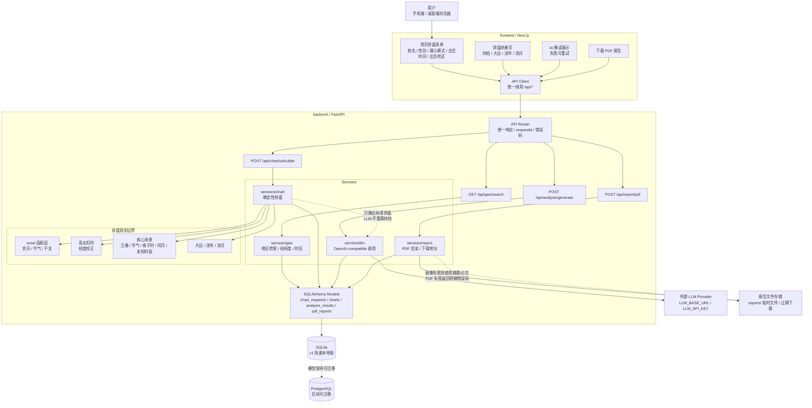
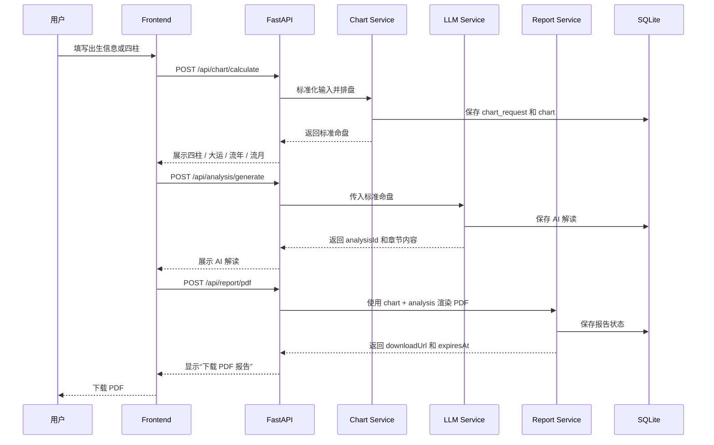

# 八字测算工具 v1.0 架构图

```mermaid
flowchart TB
  user["用户<br/>手机端 / 桌面端浏览器"]

  subgraph frontend["frontend / Next.js"]
    home["首页排盘表单<br/>姓名 / 性别 / 输入模式 / 出生时间 / 出生地区"]
    result["排盘结果页<br/>四柱 / 大运 / 流年 / 流月"]
    analysisView["AI 解读展示<br/>失败可重试"]
    pdfButton["下载 PDF 报告"]
    apiClient["API Client<br/>统一调用 /api/*"]
  end

  subgraph backend["backend / FastAPI"]
    router["API Router<br/>统一响应 / requestId / 错误码"]

    geoApi["GET /api/geo/search"]
    chartApi["POST /api/chart/calculate"]
    analysisApi["POST /api/analysis/generate"]
    reportApi["POST /api/report/pdf"]

    subgraph services["Services"]
      geoService["services/geo<br/>地区检索 / 经纬度 / 时区"]
      chartService["services/chart<br/>确定性排盘"]
      llmService["services/llm<br/>OpenAI-compatible 调用"]
      reportService["services/report<br/>PDF 渲染 / 下载地址"]
    end

    subgraph chartRules["排盘规则边界"]
      calendar["sxtwl 适配层<br/>农历 / 节气 / 干支"]
      trueSolar["真太阳时<br/>经度校正"]
      edgeCases["核心场景<br/>立春 / 节气 / 夜子时 / 闰月 / 未知时辰"]
      cycles["大运 / 流年 / 流月"]
    end

    dbModels["SQLAlchemy Models<br/>chart_requests / charts / analysis_results / pdf_reports"]
  end

  sqlite[("SQLite<br/>v1 快速本地版")]
  postgres[("PostgreSQL<br/>后续可迁移")]
  llm["外部 LLM Provider<br/>LLM_BASE_URL / LLM_API_KEY"]
  fileStore["报告文件存储<br/>reports/ 临时文件 / 过期下载"]

  user --> home
  home --> apiClient
  result --> apiClient
  analysisView --> apiClient
  pdfButton --> apiClient

  apiClient --> router
  router --> geoApi
  router --> chartApi
  router --> analysisApi
  router --> reportApi

  geoApi --> geoService
  chartApi --> chartService
  analysisApi --> llmService
  reportApi --> reportService

  geoService --> dbModels
  chartService --> calendar
  chartService --> trueSolar
  chartService --> edgeCases
  chartService --> cycles
  chartService --> dbModels
  llmService --> dbModels
  reportService --> dbModels

  dbModels --> sqlite
  sqlite -. "模型保持可迁移" .-> postgres

  llmService --> llm
  reportService --> fileStore

  chartService -. "只输出标准命盘<br/>LLM 不重算四柱" .-> llmService
  reportService -. "画像失败则使用摘要/占位<br/>PDF 失败返回明确错误码" .-> fileStore
```

## 数据流

```mermaid
sequenceDiagram
  participant U as 用户
  participant F as Frontend
  participant B as FastAPI
  participant C as Chart Service
  participant L as LLM Service
  participant R as Report Service
  participant DB as SQLite

  U->>F: 填写出生信息或四柱
  F->>B: POST /api/chart/calculate
  B->>C: 标准化输入并排盘
  C->>DB: 保存 chart_request 和 chart
  C-->>B: 返回标准命盘
  B-->>F: 展示四柱 / 大运 / 流年 / 流月

  F->>B: POST /api/analysis/generate
  B->>L: 传入标准命盘
  L->>DB: 保存 AI 解读
  L-->>B: 返回 analysisId 和章节内容
  B-->>F: 展示 AI 解读

  F->>B: POST /api/report/pdf
  B->>R: 使用 chart + analysis 渲染 PDF
  R->>DB: 保存报告状态
  R-->>B: 返回 downloadUrl 和 expiresAt
  B-->>F: 显示“下载 PDF 报告”
  F-->>U: 下载 PDF
```

