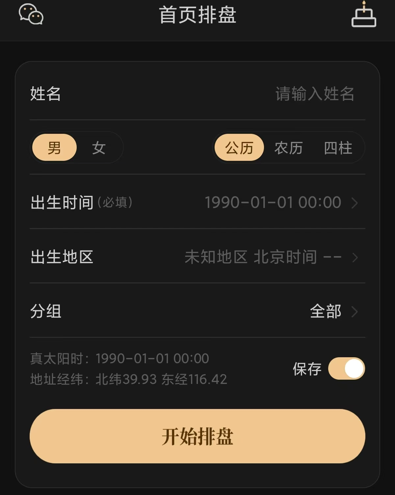
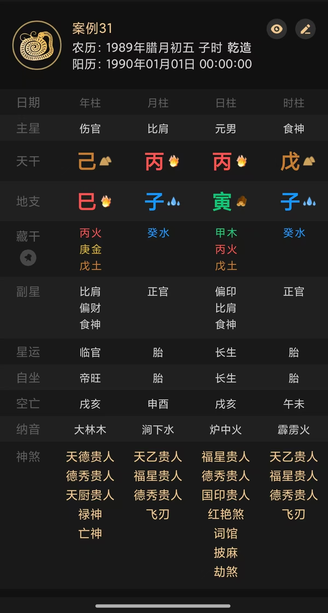
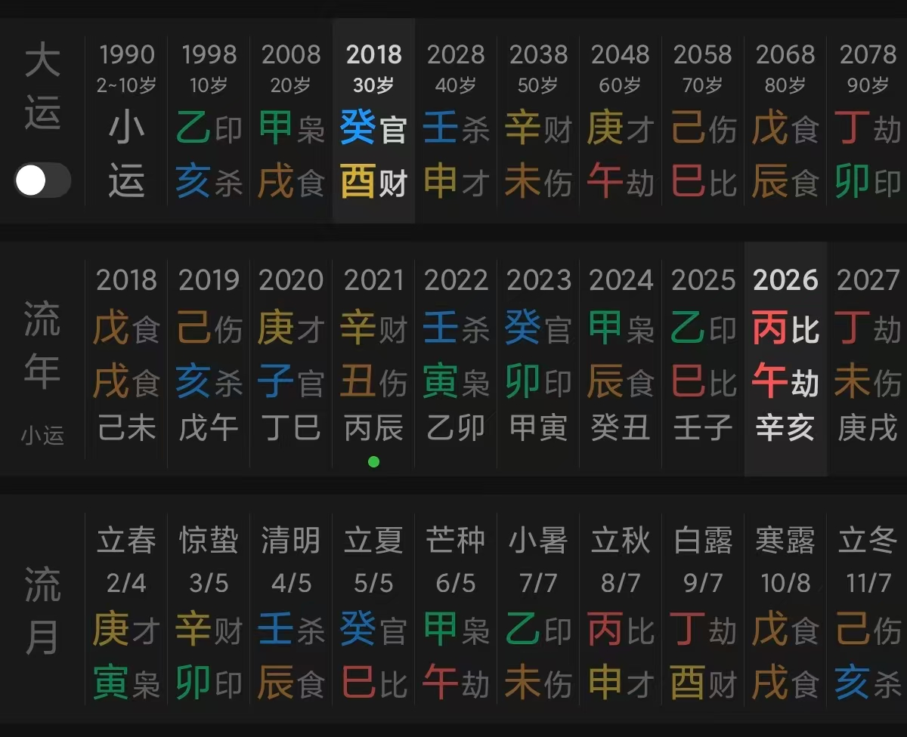
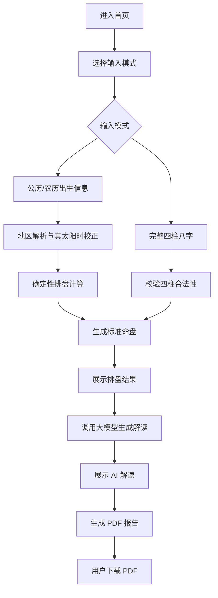

# 八字测算工具软件开发说明书

版本：v1.0  
文档用途：面向产品、前端、后端、算法和测试人员，用于开发第一版网页端八字测算工具。  
交付目标：用户通过网页输入出生信息或完整八字，系统完成排盘、AI 解读，并生成可下载 PDF 报告。

## 1. 项目概述

本项目是一个网页端八字测算工具，支持手机端和电脑端自适应访问。用户可以通过两种方式开始测算：

1. 输入姓名、性别、出生日期时间、历法类型和出生地，由系统计算四柱八字。
2. 直接输入完整四柱八字，系统跳过出生日期排盘过程，直接进入命盘展示和 AI 分析。

系统必须使用确定性算法或历法库完成排盘计算，包括四柱、大运、流年、流月、真太阳时等核心数据。大模型只负责基于排盘结果生成命理解读、综合建议和报告文案，不负责直接计算四柱。

命理分析仅作为传统文化参考，不构成医学、财务、法律或其他专业决策建议。

## 2. 范围与默认假设

### 2.1 本期范围

- 网页端首页排盘表单。
- 出生信息排盘。
- 完整八字手动输入。
- 四柱命盘结果展示。
- 大运、流年、流月展示。
- AI 命理分析。
- PDF 报告生成与下载。
- 手机端与电脑端响应式适配。

### 2.2 本期不做

- 用户登录、注册、会员、支付。
- 后台管理系统。
- 多租户和机构管理。
- 多人档案管理。
- 订单系统。
- 社交分享、评论、社区功能。

### 2.3 术语

| 术语 | 说明 |
| --- | --- |
| 四柱 | 年柱、月柱、日柱、时柱。 |
| 八字 | 四柱中的四个天干和四个地支。 |
| 真太阳时 | 按出生地经纬度对北京时间进行校正后的时间。 |
| 大运 | 以十年为一步的运势周期。 |
| 流年 | 每一年的干支运势。 |
| 流月 | 当前年份内按节气划分的月份运势。 |
| AI 解读 | 大模型基于排盘结构生成的文字分析。 |

## 3. 推荐技术方案

### 3.1 前端

- 框架：Next.js + React + TypeScript。
- 样式：Tailwind CSS 或 CSS Modules。
- 状态管理：优先使用 React 内置状态；如后续复杂化再引入 Zustand。
- 表单校验：React Hook Form + Zod。
- 图表或表格：优先自研轻量组件，保证移动端可横向滑动。
- PDF 下载：前端只触发接口并展示下载状态，不在浏览器端生成正式报告。

### 3.2 后端

- 框架：Python FastAPI。
- 排盘服务：独立 `services/chart` 模块。
- AI 服务：独立 `services/llm` 模块。
- 报告服务：独立 `services/report` 模块。
- 配置：通过环境变量读取 LLM、数据库、地理编码等配置。
- 接口格式：全部使用 JSON；PDF 下载接口返回文件 URL 或二进制流。

### 3.3 数据库

推荐 PostgreSQL。第一版如果需要快速交付，可以使用 SQLite，但数据模型应保持可迁移到 PostgreSQL。

核心表建议：

| 表名 | 用途 |
| --- | --- |
| `chart_requests` | 保存一次排盘请求的原始输入、标准化输入和状态。 |
| `charts` | 保存计算后的命盘结构。 |
| `analysis_results` | 保存 AI 解读结果。 |
| `pdf_reports` | 保存 PDF 报告文件路径、生成状态和下载地址。 |

### 3.4 大模型接口

采用 OpenAI-compatible API 抽象，后端通过环境变量配置：

```env
LLM_BASE_URL=https://api.example.com/v1
LLM_API_KEY=replace-with-real-key
LLM_MODEL=replace-with-model-name
LLM_TIMEOUT_SECONDS=60
```

后端不得在前端暴露 `LLM_API_KEY`。所有 AI 调用必须由后端完成。

## 4. 页面与交互

### 4.1 首页排盘页

页面目的：收集用户排盘所需信息，并提交排盘。

参考图：



#### 4.1.1 页面字段

| 字段 | 类型 | 必填 | 说明 |
| --- | --- | --- | --- |
| 姓名 | 文本输入 | 是 | 用于报告展示。 |
| 性别 | 分段按钮 | 是 | 男 / 女。影响大运顺逆。 |
| 输入模式 | 分段按钮 | 是 | 公历 / 农历 / 四柱。 |
| 出生时间 | 日期时间选择 | 公历和农历模式必填 | 精确到分钟；未知时辰可允许用户选择“不确定”。 |
| 出生地区 | 地区选择 | 公历和农历模式必填 | 用于获取经纬度并校正真太阳时。 |
| 分组 | 下拉选择 | 否 | 第一版可固定为“全部”，为后续档案分组预留。 |
| 真太阳时 | 只读文本 | 自动生成 | 根据出生地经纬度计算。 |
| 地址经纬 | 只读文本 | 自动生成 | 展示出生地纬度和经度。 |
| 保存 | 开关 | 否 | 第一版无登录时仅作为本地保存偏好；若无保存能力，可隐藏。 |
| 开始排盘 | 按钮 | 是 | 提交表单。 |

#### 4.1.2 输入模式

公历模式：
- 用户输入公历出生日期时间。
- 系统根据出生地计算真太阳时。
- 系统根据节气、立春、夜子时等规则计算四柱。

农历模式：
- 用户输入农历出生日期时间。
- 必须支持闰月标记。
- 系统先转换为公历，再进行排盘。

四柱模式：
- 用户直接输入年柱、月柱、日柱、时柱。
- 系统跳过出生日期换算。
- 如用户未知时柱，可允许时柱为空，并进入六字分析。

#### 4.1.3 表单校验

- 姓名不能为空，最长 30 个字符。
- 性别必须选择。
- 公历/农历模式必须提供出生日期。
- 出生地必须能解析出经纬度。
- 四柱模式至少必须提供年柱、月柱、日柱；时柱可选。
- 天干必须属于：甲、乙、丙、丁、戊、己、庚、辛、壬、癸。
- 地支必须属于：子、丑、寅、卯、辰、巳、午、未、申、酉、戌、亥。

#### 4.1.4 状态

| 状态 | 页面表现 |
| --- | --- |
| 初始 | 显示默认值和空表单。 |
| 校验失败 | 在字段附近展示错误提示，按钮保持可点击。 |
| 地区解析中 | 出生地行展示加载状态。 |
| 排盘中 | `开始排盘` 按钮进入 loading，禁止重复提交。 |
| 排盘成功 | 跳转到排盘结果页。 |
| 排盘失败 | 展示错误提示，保留用户输入。 |

### 4.2 排盘结果页

页面目的：展示系统计算出的命盘结构，作为 AI 分析和 PDF 报告的基础。

四柱展示参考图：


大运、流年、流月展示参考图：


#### 4.2.1 四柱信息

页面必须展示：

- 农历日期。
- 公历日期。
- 年柱、月柱、日柱、时柱。
- 主星。
- 天干。
- 地支。
- 藏干。
- 副星。
- 星运。
- 自坐。
- 空亡。
- 纳音。
- 神煞。

日柱需要明确标识为“日主”。如果时辰未知，时柱列展示“未知”，且所有依赖时柱的分析项不得强行推断。

#### 4.2.2 大运信息

页面必须展示：

- 起运年龄。
- 每步大运的开始年份。
- 每步大运的年龄范围。
- 每步大运的干支。
- 当前所处大运高亮。

#### 4.2.3 流年信息

页面必须展示：

- 当前年份附近至少 10 年流年。
- 当前年份高亮。
- 每年干支。
- 与大运、原局的基础关系字段。

#### 4.2.4 流月信息

页面必须展示当前年份的 12 个节气月份：

- 节气名称。
- 节气日期。
- 流月干支。
- 月份对应关系。

### 4.3 AI 解读页

页面目的：基于排盘结果生成文字解读。

#### 4.3.1 解读内容

AI 解读至少包含：

- 命主画像图生成说明。
- 日主强弱分析。
- 用神分析。
- 十神结构分析。
- 命局类型判断，例如官印相生、杀印相生、财官相生、食伤生财等。
- 五行平衡分析。
- 格局判断。
- 喜用神和忌神建议。
- 命主性格分析。
- 当前大运分析。
- 当前流年分析。
- 未来 1-3 年趋势。
- 事业方向建议。
- 职业倾向分析，例如是否具备公职、管理、技术、商业、自由职业等倾向。
- 财运趋势。
- 感情婚姻。
- 婚姻择偶分析，包括恋爱、夫妻关系、婚姻稳定性等。
- 适合城市分析，包括全国范围和出生省份/当前省份范围。
- 健康注意事项。
- 历史事件校准问题。
- 免责声明。

#### 4.3.2 历史事件校准

AI 需要根据命盘和大运流年提出 3-5 个已经发生的时间段预测，用于让用户校准分析准确性。

示例：

- 某年或某年龄段是否发生过学习、事业、搬迁、家庭、感情方面的重要变化。
- 某一步大运期间生活重心是否明显偏向事业、财富、家庭或学业。

第一版只生成校准问题，不要求用户反馈后自动二次修正。

### 4.4 PDF 报告

页面目的：用户可下载完整命理报告。

PDF 排盘展示参考图：



PDF 大运、流年、流月展示参考图：



PDF 报告内容至少包含：

- 基本信息。
- 命主画像图。
- 四柱排盘表。
- 大运表。
- 流年概览。
- 流月概览。
- 用神分析。
- 十神分析和命局类型。
- 命主性格分析。
- 职业分析。
- 财运分析，必须结合当前大运和流年。
- 婚姻分析，必须覆盖恋爱、择偶、夫妻关系和婚姻稳定性。
- 适合城市分析，必须覆盖全国城市建议和本省城市建议。
- 身体状况分析。
- 历史事件校准问题。
- 综合建议。
- 免责声明。

#### 4.4.1 PDF 版式要求

- PDF 采用竖版 A4 页面。
- 首页顶部展示报告标题、姓名、性别、公历/农历生日、出生地、真太阳时和生成日期。
- 命主画像图放在首页上半部分，作为报告视觉入口。画像需要根据日主五行、命局寒暖燥湿、喜用神和整体气质生成，不得使用真人照片。
- 四柱排盘表优先按参考图的深色卡片样式组织，也可以在 PDF 中转为适合打印的浅色表格，但字段顺序必须一致。
- 大运、流年、流月必须分区展示；如果内容过宽，允许分页或横向缩放，但不得裁切文字。
- AI 分析内容按章节分页，避免把长段文字塞进表格单元格。
- 每个分析章节需要有明确标题、摘要和正文。
- PDF 页脚展示页码和免责声明短句。
- 报告末尾必须展示完整免责声明。

PDF 文件名建议：

```text
八字测算报告_{姓名}_{生成日期}.pdf
```

## 5. 核心业务流程



## 6. 排盘规则

### 6.1 信息收集

系统需要收集：

- 姓名。
- 性别。
- 公历生日或农历生日。
- 出生具体时间或时辰。
- 出生地。
- 当前日期。

第一版不强制收集曾用名和在世状态；这两个字段可在后续高级分析中扩展。

### 6.2 年柱

- 以立春为年份分界线，不以农历正月初一为分界线。
- 立春前出生归上一年干支。
- 年干支按六十甲子循环推算。

### 6.3 月柱

- 以节气为月份分界线，不直接按农历月份。
- 月支对应：
  - 立春后为寅月。
  - 惊蛰后为卯月。
  - 清明后为辰月。
  - 立夏后为巳月。
  - 芒种后为午月。
  - 小暑后为未月。
  - 立秋后为申月。
  - 白露后为酉月。
  - 寒露后为戌月。
  - 立冬后为亥月。
  - 大雪后为子月。
  - 小寒后为丑月。
- 月干按年上起月法计算。

### 6.4 日柱

- 使用可靠万年历算法或成熟历法库计算。
- 夜子时需要特殊处理：23:00 后按次日计算日柱，并在结果中注明。

### 6.5 时柱

- 根据真太阳时确定时辰地支。
- 根据日上起时法确定时柱天干。
- 如果用户选择“不确定时辰”，时柱为未知，只做年、月、日三柱分析。

### 6.6 真太阳时

- 根据出生地经度与东八区标准经度 120 度计算时间校正。
- 真太阳时用于时辰判断。
- 页面需要展示校正后的真太阳时和出生地经纬度。

### 6.7 大运

- 根据性别和年干阴阳确定顺排或逆排。
- 阳年男、阴年女顺排。
- 阴年男、阳年女逆排。
- 以出生时间到最近节气的时间差计算起运年龄。
- 每步大运为 10 年。

### 6.8 流年与流月

- 流年按公历年份对应干支计算。
- 流月按节气月份计算。
- 当前年份、当前流年和当前大运需要高亮。

## 7. API 设计

### 7.1 统一响应格式

成功：

```json
{
  "success": true,
  "data": {},
  "requestId": "req_20260703213000001"
}
```

失败：

```json
{
  "success": false,
  "error": {
    "code": "VALIDATION_ERROR",
    "message": "出生时间不能为空",
    "details": {}
  },
  "requestId": "req_20260703213000001"
}
```

### 7.2 地区检索

```http
GET /api/geo/search?keyword=北京
```

用途：根据用户输入的出生地返回候选地区和经纬度。

响应：

```json
{
  "success": true,
  "data": [
    {
      "name": "北京市",
      "province": "北京市",
      "city": "北京市",
      "latitude": 39.93,
      "longitude": 116.42,
      "timezone": "Asia/Shanghai"
    }
  ]
}
```

失败场景：

- `GEO_NOT_FOUND`：未找到地区。
- `GEO_PROVIDER_ERROR`：地理服务不可用。

### 7.3 排盘计算

```http
POST /api/chart/calculate
```

用途：根据出生信息或完整八字生成标准命盘。

请求：

```json
{
  "inputMode": "solar",
  "birthInput": {
    "name": "张三",
    "gender": "male",
    "calendarType": "solar",
    "birthDateTime": "1990-01-01T00:00:00+08:00",
    "isLeapMonth": false,
    "birthPlace": {
      "province": "北京市",
      "city": "北京市",
      "latitude": 39.93,
      "longitude": 116.42,
      "timezone": "Asia/Shanghai"
    },
    "unknownBirthHour": false
  },
  "manualBaziInput": null
}
```

四柱模式请求：

```json
{
  "inputMode": "manual",
  "birthInput": null,
  "manualBaziInput": {
    "name": "张三",
    "gender": "male",
    "yearPillar": "己巳",
    "monthPillar": "丙子",
    "dayPillar": "丙寅",
    "hourPillar": "戊子",
    "unknownBirthHour": false
  }
}
```

响应：

```json
{
  "success": true,
  "data": {
    "chartId": "chart_001",
    "profile": {
      "name": "张三",
      "gender": "male",
      "solarDateTime": "1990-01-01T00:00:00+08:00",
      "lunarDateText": "1989年腊月初五 子时",
      "trueSolarTime": "1990-01-01T00:00:00+08:00",
      "birthPlaceText": "北京市",
      "latitude": 39.93,
      "longitude": 116.42
    },
    "pillars": {
      "year": { "stem": "己", "branch": "巳", "tenGod": "伤官" },
      "month": { "stem": "丙", "branch": "子", "tenGod": "比肩" },
      "day": { "stem": "丙", "branch": "寅", "tenGod": "日主" },
      "hour": { "stem": "戊", "branch": "子", "tenGod": "食神" }
    },
    "luckCycles": [],
    "annualCycles": [],
    "monthlyCycles": []
  }
}
```

失败场景：

- `VALIDATION_ERROR`：字段缺失或格式错误。
- `INVALID_PILLAR`：手动输入的干支不合法。
- `CALENDAR_CONVERT_ERROR`：农历或公历转换失败。
- `CHART_CALCULATION_ERROR`：排盘计算失败。

### 7.4 AI 解读生成

```http
POST /api/analysis/generate
```

用途：根据标准命盘生成文字分析。

请求：

```json
{
  "chartId": "chart_001",
  "analysisOptions": {
    "includeCareer": true,
    "includeWealth": true,
    "includeRelationship": true,
    "includeHealth": true,
    "includeHistoryCalibration": true,
    "yearsToLookAhead": 3
  }
}
```

响应：

```json
{
  "success": true,
  "data": {
    "analysisId": "analysis_001",
    "summary": "整体分析摘要",
    "portrait": {
      "imageUrl": "/api/report/assets/portrait_001.png",
      "promptSummary": "根据日主、五行气质和喜用神生成的命主画像说明"
    },
    "dayMaster": "日主分析",
    "usefulGod": "用神分析",
    "tenGods": "十神分析",
    "chartPattern": "命局类型，例如官印相生",
    "fiveElements": "五行分析",
    "pattern": "格局分析",
    "personality": "命主性格分析",
    "currentLuck": "当前大运分析",
    "annualFortune": "流年分析",
    "career": "事业建议",
    "occupation": "职业倾向分析",
    "wealth": "财运趋势",
    "relationship": "感情婚姻",
    "marriage": "婚姻择偶分析",
    "suitableCities": {
      "national": ["杭州", "苏州", "成都"],
      "provincial": ["本省城市示例"],
      "reason": "城市五行、气候、行业机会与命局喜用的匹配说明"
    },
    "health": "健康注意事项",
    "historyCalibration": [
      "请回忆某年是否发生事业或学习方向变化。"
    ],
    "disclaimer": "命理分析仅供传统文化参考。"
  }
}
```

失败场景：

- `CHART_NOT_FOUND`：命盘不存在。
- `LLM_TIMEOUT`：大模型调用超时。
- `LLM_PROVIDER_ERROR`：大模型服务异常。
- `ANALYSIS_GENERATION_ERROR`：解读生成失败。

### 7.5 PDF 报告生成

```http
POST /api/report/pdf
```

用途：生成可下载 PDF 报告。

请求：

```json
{
  "chartId": "chart_001",
  "analysisId": "analysis_001"
}
```

响应：

```json
{
  "success": true,
  "data": {
    "reportId": "report_001",
    "fileName": "八字测算报告_张三_2026-07-03.pdf",
    "downloadUrl": "/api/report/pdf/report_001/download",
    "expiresAt": "2026-07-04T00:00:00+08:00"
  }
}
```

失败场景：

- `ANALYSIS_NOT_FOUND`：分析结果不存在。
- `PDF_RENDER_ERROR`：PDF 渲染失败。
- `REPORT_STORAGE_ERROR`：报告保存失败。

## 8. 数据结构

### 8.1 BirthInput

```ts
type BirthInput = {
  name: string;
  gender: "male" | "female";
  calendarType: "solar" | "lunar";
  birthDateTime: string;
  isLeapMonth?: boolean;
  birthPlace: {
    province: string;
    city: string;
    district?: string;
    latitude: number;
    longitude: number;
    timezone: string;
  };
  unknownBirthHour: boolean;
};
```

### 8.2 ManualBaziInput

```ts
type ManualBaziInput = {
  name: string;
  gender: "male" | "female";
  yearPillar: string;
  monthPillar: string;
  dayPillar: string;
  hourPillar?: string;
  unknownBirthHour: boolean;
};
```

### 8.3 BaziChart

```ts
type Pillar = {
  stem: string;
  branch: string;
  tenGod: string;
  hiddenStems: string[];
  secondaryStars: string[];
  starFortune?: string;
  selfSitting?: string;
  voidBranch?: string;
  nayin?: string;
  shensha: string[];
};

type BaziChart = {
  chartId: string;
  profile: {
    name: string;
    gender: "male" | "female";
    solarDateTime?: string;
    lunarDateText?: string;
    trueSolarTime?: string;
    birthPlaceText?: string;
    latitude?: number;
    longitude?: number;
  };
  pillars: {
    year: Pillar;
    month: Pillar;
    day: Pillar;
    hour?: Pillar;
  };
  dayMaster: string;
  fiveElementStats: Record<string, number>;
  luckCycles: DaYunItem[];
  annualCycles: LiuNianItem[];
  monthlyCycles: LiuYueItem[];
};
```

### 8.4 DaYunItem

```ts
type DaYunItem = {
  index: number;
  startYear: number;
  endYear: number;
  startAge: number;
  endAge: number;
  stem: string;
  branch: string;
  tenGodStem?: string;
  tenGodBranch?: string;
  isCurrent: boolean;
};
```

### 8.5 LiuNianItem

```ts
type LiuNianItem = {
  year: number;
  age?: number;
  stem: string;
  branch: string;
  tenGodStem?: string;
  tenGodBranch?: string;
  isCurrent: boolean;
  relationSummary?: string;
};
```

### 8.6 AnalysisResult

```ts
type AnalysisResult = {
  analysisId: string;
  chartId: string;
  summary: string;
  portrait: {
    imageUrl?: string;
    promptSummary: string;
  };
  dayMaster: string;
  usefulGod: string;
  tenGods: string;
  chartPattern: string;
  fiveElements: string;
  pattern: string;
  personality: string;
  currentLuck: string;
  annualFortune: string;
  career: string;
  occupation: string;
  wealth: string;
  relationship: string;
  marriage: string;
  suitableCities: {
    national: string[];
    provincial: string[];
    reason: string;
  };
  health: string;
  historyCalibration: string[];
  disclaimer: string;
  createdAt: string;
};
```

### 8.7 PdfReport

```ts
type PdfReport = {
  reportId: string;
  chartId: string;
  analysisId: string;
  fileName: string;
  downloadUrl: string;
  expiresAt?: string;
  createdAt: string;
};
```

## 9. 大模型提示词要求

后端调用大模型时，应传入结构化命盘数据，不要只传自然语言描述。

系统提示词必须包含：

- 你是一位中国传统四柱八字命理研究者。
- 分析需参考《穷通宝典》《三命通会》《滴天髓》《渊海子平》《子平真诠》等传统命理观点。
- 只基于系统提供的排盘数据解读，不得自行重算四柱。
- 每个核心分析章节必须给出对应的传统命理依据或典籍出处，不能只给笼统结论。
- 命主画像只描述适合生成图片的视觉特征和气质，不得暗示真实长相。
- 职业、财运、婚姻、城市、健康分析必须结合原局、大运和当前流年，不得脱离命盘泛泛而谈。
- 输出必须中性、建设性，不得恐吓用户。
- 健康内容必须提醒以医学诊断为准。
- 财务内容必须提醒理性决策。
- 结尾必须包含免责声明。

用户提示词应包含：

- 用户基本信息。
- 标准四柱命盘。
- 大运数据。
- 当前流年和未来 1-3 年流年。
- 当前流月数据。
- 出生地、真太阳时、经纬度。
- 需要输出的章节列表。

输出章节必须包含：

- 命主画像提示词摘要。
- 用神分析。
- 十神分析和命局类型。
- 命主性格分析。
- 职业分析。
- 财运分析。
- 婚姻择偶分析。
- 适合城市分析。
- 身体状况分析。
- 历史事件校准。
- 综合建议和免责声明。

## 10. 错误处理

| 场景 | 处理方式 |
| --- | --- |
| 用户未填姓名 | 前端提示“请输入姓名”。 |
| 未选择性别 | 前端提示“请选择性别”。 |
| 出生时间为空 | 前端提示“请选择出生时间”。 |
| 出生地无法解析 | 提示用户重新选择城市。 |
| 农历闰月缺失 | 如果该年该月存在闰月，要求用户确认是否闰月。 |
| 节气交界 | 后端返回提示，前端展示“该时间接近节气交界，结果可能对月柱敏感”。 |
| 立春交界 | 后端返回提示，前端展示“该时间接近立春，年柱需以精确节气时间为准”。 |
| 夜子时 | 结果页注明“夜子时按次日计算日柱”。 |
| 时辰未知 | 时柱显示未知，AI 解读不分析时柱相关内容。 |
| LLM 超时 | 提示“分析生成较慢，请稍后重试”，保留命盘结果。 |
| 命主画像生成失败 | PDF 继续生成，画像区域显示文字版画像摘要或默认占位图。 |
| PDF 生成失败 | 提示“报告生成失败，请重新生成”。 |

## 11. 响应式要求

### 11.1 手机端

- 首页表单单列展示。
- 分段按钮必须可点击区域足够大。
- 四柱表格可横向滑动。
- 大运、流年、流月可横向滑动。
- 底部主按钮固定或保持在视口下方易点击位置。

### 11.2 桌面端

- 首页表单居中，最大宽度建议 720px。
- 排盘结果页可使用左右布局：
  - 左侧命盘表。
  - 右侧 AI 分析摘要。
- 大运、流年、流月使用宽屏表格或卡片横排。

### 11.3 视觉风格

- 可以参考示例图的深色背景和金色主按钮。
- 页面整体应保持简洁、稳定、易读。
- 重要操作按钮文案固定为“开始排盘”。
- PDF 下载按钮文案固定为“下载 PDF 报告”。

## 12. 验收标准

### 12.1 首页

- 用户可以输入姓名。
- 用户可以切换男/女。
- 用户可以切换公历、农历、四柱。
- 用户可以选择出生时间。
- 用户可以选择出生地区。
- 页面展示真太阳时和经纬度。
- 用户点击“开始排盘”后进入排盘流程。

### 12.2 排盘

- 公历输入可以成功生成四柱。
- 农历输入可以成功转换并生成四柱。
- 四柱输入可以跳过出生日期计算。
- 立春前后、节气交界、夜子时有明确处理。
- 时辰未知时不生成时柱推断。

### 12.3 结果展示

- 四柱表包含年柱、月柱、日柱、时柱。
- 日柱明确标识为日主。
- 展示藏干、十神、副星、星运、自坐、空亡、纳音、神煞。
- 展示大运、流年、流月。
- 当前大运和当前流年有高亮。

### 12.4 AI 解读

- AI 解读基于后端命盘数据生成。
- AI 不自行重算四柱。
- 输出包含命主画像、日主、用神、十神、命局类型、五行、格局、大运、流年、性格、职业、财运、婚姻、适合城市、健康、历史校准和免责声明。
- 职业、财运、婚姻、城市和健康分析必须结合原局、大运、流年，不得只输出通用建议。
- 每个核心分析章节必须有传统命理依据或典籍出处。
- LLM 失败时不影响用户查看排盘结果。

### 12.5 PDF 报告

- 用户可以生成 PDF。
- PDF 文件能正常下载和打开。
- PDF 内容包含基本信息、命主画像、命盘表、大运、流年、流月、AI 分析和免责声明。
- PDF 版式参考 `assets/software-spec/pdf-report-format.jpg` 和 `assets/software-spec/pdf-luck-format.jpg`。
- PDF 中四柱、大运、流年、流月不得出现文字裁切、重叠或横向溢出。
- PDF 首页必须能让用户快速看到姓名、出生信息、命盘核心表格和报告生成日期。

## 13. 开发任务拆分建议

### 13.1 前端任务

- 搭建 Next.js 项目结构。
- 实现首页排盘表单。
- 实现地区搜索组件。
- 实现公历/农历/四柱模式切换。
- 实现排盘结果页。
- 实现四柱表组件。
- 实现大运、流年、流月组件。
- 实现 AI 解读展示组件。
- 实现 PDF 下载交互。
- 实现 PDF 报告预览或生成中状态提示。
- 完成手机端和桌面端适配。

### 13.2 后端任务

- 搭建 FastAPI 项目结构。
- 实现统一响应格式和错误码。
- 实现地区检索接口。
- 实现排盘计算接口。
- 实现四柱、十神、藏干、纳音、神煞等计算模块。
- 实现大运、流年、流月计算模块。
- 实现 LLM 调用模块。
- 实现 AI 解读生成接口。
- 实现命主画像生成或画像提示词生成模块。
- 实现 PDF 报告生成接口。
- 实现基础数据持久化。

### 13.3 测试任务

- 首页表单校验测试。
- 公历排盘测试。
- 农历排盘测试。
- 闰月测试。
- 立春交界测试。
- 节气交界测试。
- 夜子时测试。
- 完整八字输入测试。
- 时辰未知测试。
- LLM 超时测试。
- 命主画像生成失败降级测试。
- PDF 生成测试。
- PDF 版式字段完整性测试。
- 移动端布局测试。
- 桌面端布局测试。

## 14. 安全与合规

- 不在前端暴露大模型 API Key。
- 后端日志不得记录完整 API Key。
- 用户输入需要做长度限制和基础清洗。
- PDF 文件下载地址应设置有效期。
- 命理分析必须带免责声明。
- 涉及健康、财务、感情等建议时，必须使用中性表达，不得给出极端结论。

## 15. 第一版完成定义

满足以下条件即可认为 v1.0 完成：

- 用户能在网页端完成一次排盘。
- 系统能展示四柱、大运、流年、流月。
- 系统能生成 AI 解读。
- 系统能生成并下载 PDF 报告。
- 手机端和电脑端均可正常使用。
- 所有核心错误场景有明确提示。
- AI 解读和 PDF 报告包含免责声明。
